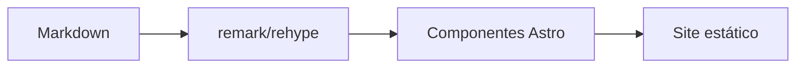

O Astro Narrow é uma versão nativa em Astro da experiência de leitura do Narrow. Ele usa coleções de conteúdo, configuração tipada, componentes Astro e transformações de Markdown em tempo de build, em vez de código de compatibilidade com Hugo.

## Configurar o `site.ts`

O arquivo `src/config/site.ts` controla a identidade do site, navegação, largura do layout, comentários, analytics, comportamento da galeria e configurações de posts.

| Opção                              | Propósito                                 |
| ---------------------------------- | ----------------------------------------- |
| `name`, `shortName`, `description` | Metadados do site                         |
| `author`                           | Cartão de perfil da home e links sociais  |
| `contentWidth`                     | Largura do layout principal               |
| `ui.navbar.sticky`                 | Navbar fixa                               |
| `ui.dock.enabled`                  | Dock inferior                             |
| `nav`                              | Navegação do cabeçalho                    |
| `footerNav`                        | Navegação do rodapé                       |
| `comments`                         | Configurações do Giscus                   |
| `analytics`                        | Configurações do Umami                    |
| `gallery`, `lightbox`              | Comportamento de imagens no Markdown      |
| `post.relatedCount`                | Quantidade de posts relacionados          |
| `post.license`                     | Bloco de licença                          |

::::tabs
:::tab{title="Site básico"}

```ts
export const siteConfig = {
  name: 'Astro Narrow',
  shortName: 'Narrow',
  description: 'Um tema Astro focado em conteúdo.',
  contentWidth: '56rem',
}
```

:::

:::tab{title="Navegação"}

```ts
export const siteConfig = {
  nav: ['posts', 'projects', 'archives', 'tags'],
  footerNav: ['archives', 'tags'],
}
```

:::

:::tab{title="Link externo"}

```ts
export const siteConfig = {
  nav: ['posts', { label: { 'en': 'GitHub', 'pt': 'GitHub' }, href: 'https://github.com/', icon: 'simple-icons:github' }],
}
```

:::
::::

## Configurar Tipos de Conteúdo

O arquivo `src/config/content.ts` define como cada tipo de conteúdo aparece na navegação, listas, cartões e seções da home.

| Opção               | Valores                              |
| ------------------- | ------------------------------------ |
| `cardStyle`         | `article`, `showcase`, `compact`     |
| `listLayout`        | `stack`, `grid`                      |
| `gridColumns`       | `1`, `2`, `3`                        |
| `home.enabled`      | Exibir o tipo na página inicial      |
| `home.limit`        | Número de entradas na página inicial |
| `home.featuredOnly` | Exibir apenas entradas em destaque   |

```ts title="src/config/content.ts"
export const contentTypes = {
  posts: {
    collection: 'posts',
    path: '/posts/',
    label: { 'en': 'Posts', 'pt': 'Publicações' },
    cardStyle: 'article',
    listLayout: 'stack',
    gridColumns: 1,
  },
}
```

## Frontmatter

Os posts usam os campos das coleções de conteúdo do Astro. Mantenha o frontmatter pequeno e previsível.

| Campo                                    | Uso                                  |
| ---------------------------------------- | ------------------------------------ |
| `title`                                  | Título da página                     |
| `description`                            | Resumo e meta description            |
| `pubDate`                                | Data de publicação                   |
| `updatedDate`                            | Data de atualização opcional         |
| `cover`                                  | Imagem de capa                       |
| `tags`                                   | Taxonomia de tags                    |
| `toc`                                    | `center`, `side`, `true` ou `false`  |
| `comments`                               | Comentários por entrada              |
| `math`, `mermaid`, `gallery`, `lightbox` | Ativação de recursos                 |

Entradas de projetos também suportam `featured` e `links`.

```yaml
links:
  - label: Website
    url: https://example.com
    icon: lucide:external-link
  - label: GitHub
    url: https://github.com/example/repo
    icon: simple-icons:github
featured: true
```

## Recursos de Markdown

> [!NOTE]
> Prefira escrever em Markdown puro. O Astro Narrow transforma padrões comuns com remark e rehype.

| Recurso  | Entrada                              |
| -------- | ------------------------------------ |
| Alertas  | Blockquotes no estilo do GitHub      |
| Abas     | `::::tabs` e `:::tab{title="..."}`   |
| Galeria  | Imagens Markdown consecutivas        |
| Matemática | `$x^2$` e `$$...$$`                |
| Mermaid  | Blocos cercados `mermaid`            |
| Código   | Blocos do Expressive Code            |

### Código

```ts title="theme.ts" {3}
type ColorMode = 'light' | 'dark' | 'auto'

export function setMode(mode: ColorMode) {
  document.documentElement.classList.toggle('dark', mode === 'dark')
}
```

### Galeria


### Matemática e Mermaid

Matemática inline funciona como $E = mc^2$.


